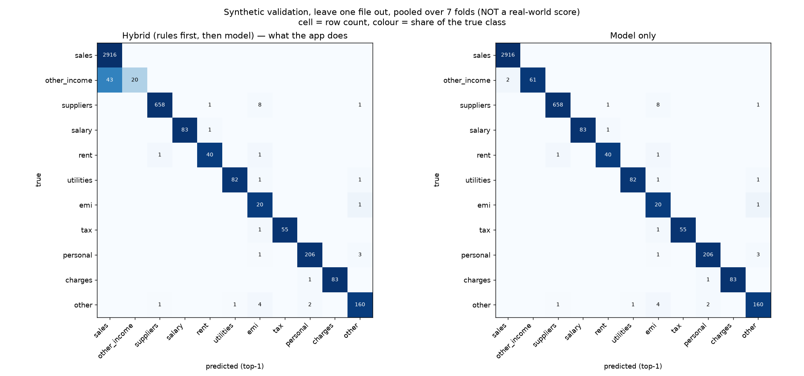

# V3 classifier — evaluation results

- **Date:** 2026-09-29
- **Command:** `cd ml && python train.py && python evaluate.py`
- **Model:** one-vs-rest LogisticRegression(C=1.0, class_weight='balanced') on char 3-5 gram TF-IDF + direction, log amount, day of month, rail (see `ml/features.py`)
- **Synthetic data:** 4396 rows from 7 files in `data/synthetic/`; 182 rows tagged `hard_case`
- **Excluded:** `CHANGELOG.csv` (edit log for the synthetic files, not a statement); `hdfc_kirana_bengaluru_v1.csv` (older generator: no hard_case column, 13 refunds/reversals on the wrong side or with the wrong category (see check_data.py))
- **Label policy:** 126 withdrawals labelled `sales` (sale reversals) scored as `other`, because the app never gives money out an income category
- **Extra training rows** (rule-labelled real + owner corrections): 0
- **Real hand-labelled rows** (`data/labels/`): 0

## Real-world score

> **Synthetic validation only, not a real-world score.** `data/labels/` is empty, so there is no real-world number yet. Everything below is measured on synthetic statements generated from one template (every file has the same count of salary, rent, tax, EMI… rows), so it will overstate how well the classifier does on a real bank statement. Do not quote these numbers as accuracy.

## Synthetic validation: leave one file out

Train on 6 synthetic files, test on the 7th, repeat for all 7. The TF-IDF vocabulary is fitted on the training files only.

### Summary per held-out file

| Test set | Approach | Rows | Macro-F1 | Accuracy (top-1) | Auto accuracy (≥ 0.8) | Review share (< 0.8) |
|---|---|---|---|---|---|---|
| 01_stable_88_92_kirana_bengaluru.csv | majority | 626 | 0.073 | 66.5% | – | – |
|  | rules | 626 | 0.854 | 91.7% | 98.9% | 11.0% |
|  | model | 626 | 0.977 | 99.5% | 100.0% | 18.2% |
|  | hybrid | 626 | 0.931 | 98.6% | 99.0% | 5.4% |
| 02_tight_93_97_pharmacy_pune.csv | majority | 630 | 0.072 | 66.0% | – | – |
|  | rules | 630 | 0.826 | 88.3% | 98.9% | 15.1% |
|  | model | 630 | 0.981 | 99.7% | 100.0% | 19.2% |
|  | hybrid | 630 | 0.935 | 98.7% | 99.0% | 7.1% |
| 03_growth_80_90_salon_hyderabad.csv | majority | 624 | 0.073 | 66.3% | – | – |
|  | rules | 624 | 0.856 | 93.1% | 98.9% | 10.1% |
|  | model | 624 | 0.959 | 99.2% | 100.0% | 16.7% |
|  | hybrid | 624 | 0.913 | 98.2% | 99.0% | 5.3% |
| 04_one_loss_month_kirana_mysuru.csv | majority | 629 | 0.073 | 67.1% | – | – |
|  | rules | 629 | 0.847 | 92.5% | 98.9% | 10.0% |
|  | model | 629 | 0.931 | 99.0% | 100.0% | 15.1% |
|  | hybrid | 629 | 0.884 | 98.1% | 99.0% | 4.3% |
| 05_volatile_pharmacy_bengaluru.csv | majority | 632 | 0.073 | 66.9% | – | – |
|  | rules | 632 | 0.828 | 89.7% | 98.9% | 13.4% |
|  | model | 632 | 0.968 | 99.4% | 100.0% | 16.1% |
|  | hybrid | 632 | 0.927 | 98.6% | 99.0% | 5.7% |
| 06_cashflow_pressure_salon_chennai.csv | majority | 625 | 0.072 | 65.4% | – | – |
|  | rules | 625 | 0.845 | 90.6% | 98.7% | 12.0% |
|  | model | 625 | 0.958 | 99.2% | 100.0% | 21.9% |
|  | hybrid | 625 | 0.905 | 98.2% | 98.8% | 6.6% |
| 07_mixed_realistic_kirana_hyderabad.csv | majority | 630 | 0.072 | 66.0% | – | – |
|  | rules | 630 | 0.859 | 91.3% | 98.9% | 11.6% |
|  | model | 630 | 0.942 | 98.9% | 100.0% | 17.5% |
|  | hybrid | 630 | 0.895 | 97.9% | 99.0% | 5.9% |
| **all 7 (pooled)** | majority | 4396 | 0.073 | 66.3% | – | – |
|  | rules | 4396 | 0.846 | 91.0% | 98.9% | 11.9% |
|  | model | 4396 | 0.957 | 99.3% | 100.0% | 17.8% |
|  | hybrid | 4396 | 0.911 | 98.3% | 99.0% | 5.8% |

### Macro-F1 by held-out file

| Held-out file | majority | rules | model | hybrid |
|---|---|---|---|---|
| 01_stable_88_92_kirana_bengaluru.csv | 0.073 | 0.854 | 0.977 | 0.931 |
| 02_tight_93_97_pharmacy_pune.csv | 0.072 | 0.826 | 0.981 | 0.935 |
| 03_growth_80_90_salon_hyderabad.csv | 0.073 | 0.856 | 0.959 | 0.913 |
| 04_one_loss_month_kirana_mysuru.csv | 0.073 | 0.847 | 0.931 | 0.884 |
| 05_volatile_pharmacy_bengaluru.csv | 0.073 | 0.828 | 0.968 | 0.927 |
| 06_cashflow_pressure_salon_chennai.csv | 0.072 | 0.845 | 0.958 | 0.905 |
| 07_mixed_realistic_kirana_hyderabad.csv | 0.072 | 0.859 | 0.942 | 0.895 |
| **mean ± sd** | 0.073 ± 0.000 | 0.845 ± 0.012 | 0.959 ± 0.017 | 0.913 ± 0.018 |

### Per-class F1 by held-out file — hybrid

| Held-out file | sales | other_income | suppliers | salary | rent | utilities | emi | tax | personal | charges | other |
|---|---|---|---|---|---|---|---|---|---|---|---|
| 01_stable_88_92_kirana_bengaluru.csv | 0.993 | 0.500 | 0.995 | 1.000 | 1.000 | 0.960 | 0.857 | 1.000 | 0.984 | 1.000 | 0.957 |
| 02_tight_93_97_pharmacy_pune.csv | 0.993 | 0.500 | 0.995 | 1.000 | 1.000 | 1.000 | 0.857 | 1.000 | 0.984 | 0.957 | 1.000 |
| 03_growth_80_90_salon_hyderabad.csv | 0.993 | 0.500 | 0.989 | 1.000 | 1.000 | 0.957 | 0.750 | 0.933 | 0.983 | 1.000 | 0.939 |
| 04_one_loss_month_kirana_mysuru.csv | 0.993 | 0.500 | 0.995 | 1.000 | 0.800 | 0.957 | 0.545 | 1.000 | 0.983 | 1.000 | 0.957 |
| 05_volatile_pharmacy_bengaluru.csv | 0.993 | 0.500 | 1.000 | 1.000 | 1.000 | 1.000 | 0.800 | 1.000 | 0.966 | 1.000 | 0.941 |
| 06_cashflow_pressure_salon_chennai.csv | 0.992 | 0.364 | 0.990 | 1.000 | 0.923 | 1.000 | 0.750 | 1.000 | 0.984 | 1.000 | 0.957 |
| 07_mixed_realistic_kirana_hyderabad.csv | 0.993 | 0.500 | 0.974 | 0.957 | 0.923 | 1.000 | 0.545 | 1.000 | 1.000 | 1.000 | 0.958 |
| **pooled** | 0.993 | 0.482 | 0.991 | 0.994 | 0.952 | 0.982 | 0.702 | 0.991 | 0.983 | 0.994 | 0.958 |

### Per-class F1 by held-out file — model

| Held-out file | sales | other_income | suppliers | salary | rent | utilities | emi | tax | personal | charges | other |
|---|---|---|---|---|---|---|---|---|---|---|---|
| 01_stable_88_92_kirana_bengaluru.csv | 1.000 | 1.000 | 0.995 | 1.000 | 1.000 | 0.960 | 0.857 | 1.000 | 0.984 | 1.000 | 0.957 |
| 02_tight_93_97_pharmacy_pune.csv | 1.000 | 1.000 | 0.995 | 1.000 | 1.000 | 1.000 | 0.857 | 1.000 | 0.984 | 0.957 | 1.000 |
| 03_growth_80_90_salon_hyderabad.csv | 1.000 | 1.000 | 0.989 | 1.000 | 1.000 | 0.957 | 0.750 | 0.933 | 0.983 | 1.000 | 0.939 |
| 04_one_loss_month_kirana_mysuru.csv | 1.000 | 1.000 | 0.995 | 1.000 | 0.800 | 0.957 | 0.545 | 1.000 | 0.983 | 1.000 | 0.957 |
| 05_volatile_pharmacy_bengaluru.csv | 0.999 | 0.941 | 1.000 | 1.000 | 1.000 | 1.000 | 0.800 | 1.000 | 0.966 | 1.000 | 0.941 |
| 06_cashflow_pressure_salon_chennai.csv | 0.999 | 0.941 | 0.990 | 1.000 | 0.923 | 1.000 | 0.750 | 1.000 | 0.984 | 1.000 | 0.957 |
| 07_mixed_realistic_kirana_hyderabad.csv | 1.000 | 1.000 | 0.974 | 0.957 | 0.923 | 1.000 | 0.545 | 1.000 | 1.000 | 1.000 | 0.958 |
| **pooled** | 1.000 | 0.984 | 0.991 | 0.994 | 0.952 | 0.982 | 0.702 | 0.991 | 0.983 | 0.994 | 0.958 |

### Hard cases (`hard_case = 1`, pooled over the 7 folds)

Same payee (or a payee-less `UPI/<ref>`) seen as both a customer and a payee. The narration alone can't tell these apart; ideally they go to review rather than being guessed wrong.

| Test set | Approach | Rows | Macro-F1 | Accuracy (top-1) | Auto accuracy (≥ 0.8) | Review share (< 0.8) |
|---|---|---|---|---|---|---|
| hard_case = 1 | majority | 182 | 0.077 | 73.1% | – | – |
|  | rules | 182 | 0.114 | 76.9% | 98.5% | 25.8% |
|  | model | 182 | 0.240 | 83.0% | 100.0% | 78.0% |
|  | hybrid | 182 | 0.240 | 83.0% | 98.5% | 25.8% |
| hard_case = 0 | majority | 4214 | 0.072 | 66.0% | – | – |
|  | rules | 4214 | 0.862 | 91.6% | 98.9% | 11.3% |
|  | model | 4214 | 0.999 | 100.0% | 100.0% | 15.2% |
|  | hybrid | 4214 | 0.952 | 99.0% | 99.0% | 4.9% |

Hard cases the hybrid gets wrong *without* sending them to review: 2 of 182.

| Narration | Dir | True | Predicted | By | Rows |
|---|---|---|---|---|---|
| `UPI/680266970934` | C | other_income | sales | rule | 1 |
| `UPI/825891818768` | C | other_income | sales | rule | 1 |

### Where the rules disagree with the labels

A rule match is final (confidence 1) and outranks the model, so every row below is a mistake the app makes without asking. Digits are masked as `#`.

| Narration pattern | Dir | True | Rule says | Rows | Hard cases | Model alone right |
|---|---|---|---|---|---|---|
| `UPI/RAJESHK@OKHDFCBANK/#/Payment from` | C | other_income | sales | 41 | 0 | 41 |
| `UPI/#` | C | other_income | sales | 2 | 2 | 0 |

## Confusion matrix

`docs/confusion_matrix.png`: synthetic leave-one-file-out predictions, pooled (not a real-world score).

## How to read this

- **majority** shows why accuracy is misleading here: always saying `sales` is right on most rows but has a very low macro-F1.
- **rules** are always confident when they match; rows with no rule go to review.
- **hybrid** is what the app does. Compare its auto accuracy with its review share: a lower threshold would send fewer rows to review but make more silent mistakes.
- The spread across held-out files (mean ± sd) matters more than any single number.
